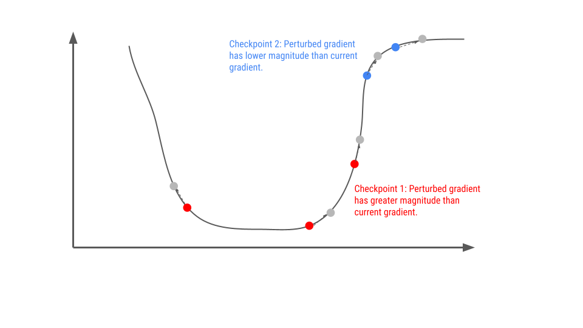
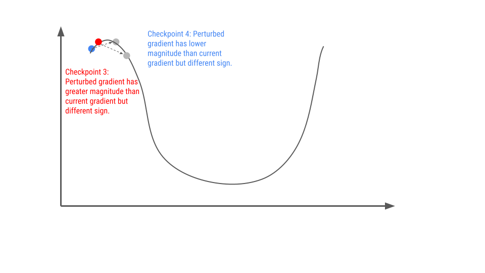
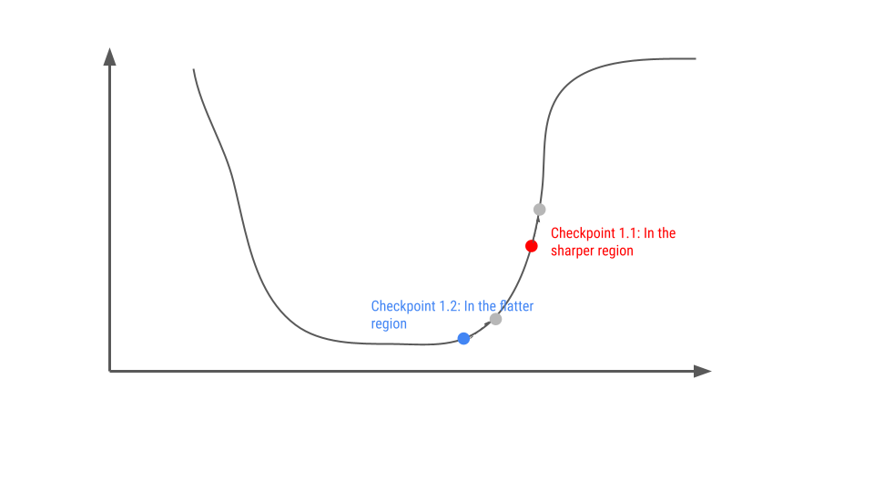
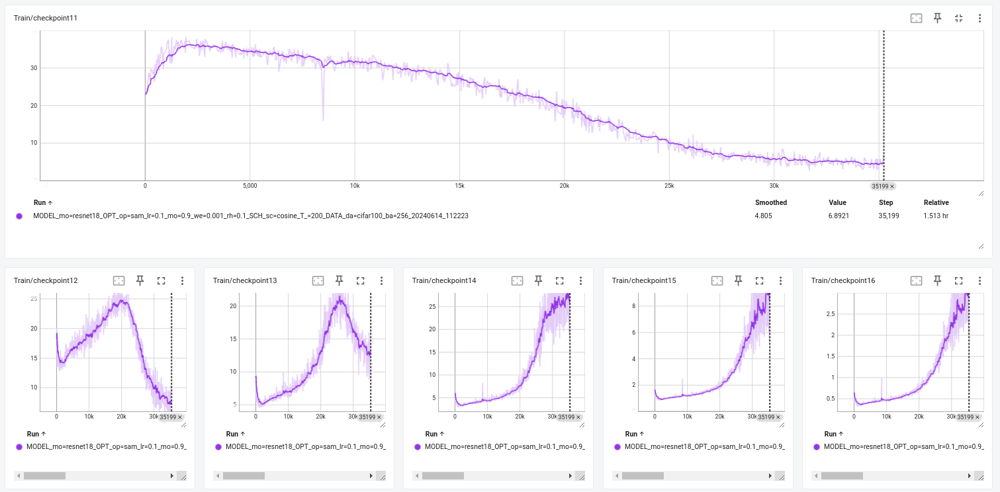

# Geometry Sharpness-Aware Minimization

In Sharpness-Aware Minimization, they compute gradients at two different positions within one update step, denoted as $\nabla L(w_t)$ and $\nabla L(w_t + \rho \frac{ \nabla L(w_t) }{ || \nabla L(w_t) || })$. This allows us to explore the geometry of the loss landscape through these gradients.

To validate the geometry of loss landscape, we use the ratio of the perturbed gradient to the current gradient :

$$\nabla L(w_t + \rho \frac{ \nabla L(w_t) }{ || \nabla L(w_t) || }) / \nabla L(w_t)
$$

The figure below illustrates the effectiveness of this metric in depicting the local convex minima.

In the figure, `checkpoint1` and `checkpoint2` are notable because their perturbed gradients share the same sign as the current gradient. Experiments show that during training, over $60 \%$ of parameters belong to `checkpoint1`. Conversely, `checkpoint2` starts at around $40 \%$ in the early stage and decreases to $20 \%$ in the later stage.

In contrast, `checkpoint3` and `checkpoint4` depict scenarios where the signs of the perturbed and current gradients differ. During training, the number of parameters associated with `checkpoint3` and `checkpoint4` is initially very low, at around $3\%$, but increases to $10 \%$ and $6 \%$ respectively in the later stages.

## Insights from Experiments

- **Loss Landscape Geometry**:
  - The geometry is predominantly characterized by `checkpoint1`.
  - As training progresses, there is a transition through `checkpoint2`, `checkpoint3`, and `checkpoint4`.
  - In the late stages of training, the loss landscape shows multiple minima regions, indicated by an increase in `checkpoint3` and `checkpoint4`.
  - Surprisingly, the number of `checkpoint1` parameters does not decrease, suggesting a significant number of parameters remain on the ridge of the landscape.

## Further Experiments

**Key Question**: Which checkpoint among the four contributes most to finding the flat minima in SAM?

| rho           | SGD | ori-SAM | checkpoint1 | checkpoint2 | checkpoint3 | checkpoint4 | 
|---------------|---------|---------|-------------|-------------|-------------|-------------|
| $\rho = 0.1$  | 77.36% | 78.84 % | **79.06** %     | 78.26 %     | 78.38 %     | 78.60 %
| $\rho = 0.2$  | 77.36% | **79.55** % | **79.31** %     | 78.27 %     | 78.15 %     | 78.30 %
| $\rho = 0.4$  | 77.36% | 79.21 % | **79.58** %     | 77.99 %     | 79.04 or 78.49 %     | 77.84 %
| $\rho = 0.6$  | 77.36% | 77.98 % | **78.58** %     | 78.16 %     | 77.72 %     | ??? %
| $\rho = 0.8$  | 77.36% | ??? % | **78.79** %     | 77.38 %     | 76.98 %     | ??? %

| rho           | SGD | ori-SAM | checkpoint12 | checkpoint13 | checkpoint14 | checkpoint134 |  checkpoint123 |
|---------------|---------|---------|-------------|-------------|-------------|-------------|-------------|
| $\rho = 0.1$  | 77.36% | 78.84 % | 79.46 %     | **79.64** %     | 78.58 % | 79.41 %   | 79.44 %
| $\rho = 0.2$  | 77.36% | 79.55 % | **79.78** %     | **79.81** %    | 78.68 % | 78.94 %   | **79.85** %
| $\rho = 0.4$  | 77.36% | 79.21 % | **79.79** %     | 79.29 %     | 78.91 % | 78.86 %  | **79.73** %
| $\rho = 0.6$  | 77.36% | 77.98 % | 79.09 %     | 79.23 %     | 77.21 % | **79.72** %  | 79.27 %
| $\rho = 0.8$  | 77.36% | ??? % | 78.60 %     | **79.36** %     |  75.86 % |78.72 %  | 78.18 %

### Experiment 1:
- **Hypothesis**: Maintaining the magnitude of all parameters in `checkpoint1` while replacing others with the magnitude from SGD would still retain SAM's ability to find flat minima.
- **Results**: 
  - SAM's ability to find flat minima was maintained.
  - Repeating this experiment with other checkpoints resulted in sharper minima.
- **Conclusion**: The realistic ability of SAM is due to its effective learning rate, evidenced by `checkpoint1`, not direction modification.

### Experiment 2:
- **Research Question**: How long does the ratio of perturbed gradient to current gradient in `checkpoint1` remain consistent?
- **Results**: 
  - At step 172, `checkpoint1` contained $6 \times 10^6$ parameters. 
  - There was an overlap of about $4 \times 10^6$ parameters with later steps, maintaining around $4 \times 10^6$ (or 40%) even at the final step.
  - This indicates that 40% of parameters require a higher learning rate than the initial one.
  
### Experiment 3:
- **Research Question**: Are the same $4 \times 10^6$ parameters consistent over many steps?
- **Answer**: No. After just 5 steps, the overlap reduced to $10^5$ and continued to diminish.

### Experiment 4:
- **Research Question**: Does large batch training lower generalization due to low learning rates?
- **Comparison**: 
  - ResNet18 on CIFAR100 with batch size 1024 and SGD learning rates of 0.1 and 0.2.
  - The gradient norm with batch size 1024 was lower than with batch size 256, hinting slower learning with a higher batch size.
  - Increasing the learning rate in the batch size 1024 experiment improved test accuracy.

## Conclusion

- The effectiveness of SAM is attributed to its adaptive learning rate.
- 60% of parameters do not converge even after 200 epochs, potentially due to learning rate decay.

# More explorations

## Project 1:

## How Many Parameters in These 60% Parameters are in Flat Minima?

We classified the parameters from `checkpoint1` into two types, as illustrated in the figure below:

1. **Initial Approach: Diagonal Hessian**
   - We initially attempted to use the diagonal Hessian to determine parameter flatness. However, the shape of this approximation differed from the gradient, making it challenging to proceed with this metric.

2. **Current Approach: Gradient Magnitude**
   - We decided to use the gradient magnitude as the metric to determine the flatness of each parameter. This approach provided a more straightforward and consistent method for our analysis.

### Experiment Details

- **Data Preparation:**
  - We stored the flattened tensors of `checkpoint1` and computed the absolute values of the gradient magnitudes.

- **Threshold Determination:**
  - Our hypothesis is that a higher gradient magnitude corresponds to higher flatness. To verify this, we sorted the `magnitude_gradient` tensor in decreasing order.
  - We then determined the `threshold` as the value of `magnitude_gradient` at the position corresponding to the length of `checkpoint1`.

- **Calculation of Flat Minima:**
  - We calculated the percentage of parameters from `checkpoint1` with gradient magnitudes greater than the determined threshold. This percentage represents the proportion of parameters in `checkpoint1` that are in flat minima.

By following this methodology, we can identify the flat minima among the parameters in `checkpoint1` and gain insights into their distribution.

| Epoch | `mag_grad[len(checkpoint1)]` | percent % | 
|-------|------------------------------|-----------|
| 5   | 0.00013771              | 63%
| 10   | 0.00015848              | 64%
| 15   | 0.00016051              | 65%
| 20   | 0.00016005              | 67%
| 25   | 0.00015288              | 67%
| 30   | 0.00017219              | 66%
| 35   | 0.00014082              | 69%
| 40   | 0.00019160              | 66%
| 45   | 0.00017323              | 69%
| 50   | 0.00016461              | 69%
| 55   | 0.00018168              | 66%
| 60   | 0.00019630              | 67%
| 65   | 0.00017031              | 68%
| 70   | 0.00017464              | 66%
| 75   | 0.00016619              | 70%
| 80   | 0.00017488              | 71%
| 85   | 0.00018003              | 69%
| 90   | 0.00016166              | 70%
| 95   | 0.00011792              | 75%
| 100   | 0.00014122              | 75%
| 105   | 0.00015415              | 74%
| 110   | 0.00014154              | 74%
| 115   | 0.00019645              | 71%
| 120   | 0.00019847              | 71%
| 125   | 0.00017283              | 72%
| 130   | 0.00018389              | 72%
| 135   | 0.00013861              | 73%
| 140   | 0.00014639              | 76%
| 145   | 0.00012558              | 73%
| 150   | 0.00012297              | 72%
| 155   | 0.00009237              | 76%
| 160   | 0.00007134              | 78%
| 165   | 0.00012038              | 73%
| 170   | 0.00010611              | 67%
| 175   | 0.00011405              | 67%
| 180   | 0.00004605              | 80%
| 185   | 0.00007793              | 66%
| 190   | 0.00008220              | 64%
| 195   | 0.00004291              | 77%
| 200   | 0.00015874              | 59%   

### Insights from Experiment

- **Checkpoint1 Gradient Magnitude**: 
  - In `checkpoint1`, over 60% of parameters have a gradient magnitude exceeding the threshold.
  - There is an observable trend of increasing gradient magnitude in the later stages.

- **Sharp Region Identification**:
  - The experiment suggests that most parameters in `checkpoint1` reside in a sharp region, which we denote as `checkpoint1.1`.

## Project 2:

**Statistic for checkpoint1?**

Methods to validate: Counting how many parameters having ratio $< 1.2, < 1.5, < 2, < 4, < 8, < 16$, denoted as `checkpoint1.1`, `checkpoint1.2`, `checkpoint1.3`, `checkpoint1.4`, `checkpoint1.5`, `checkpoint1.6`, respectively. The results shown as below:

### Observation

- At first, the parameters belong to `checkpoint1.1` which have the ratio $< 1.2$ are highest, but then decrease fast. 
- In the later stage, almost the parameters belong to `checkpoint1.1` has the ratio increase fast, evidenced by `checkpoint1.3`, `checkpoint1.4`, `checkpoint1.5`, `checkpoint1.6`.

### Further Question: 
- Instead of increasing magnitude follows ratio, increase with the fixed constant.
- Why preconditioning $H(w)$ is not effecitve for deep learning especially over-parameterized setting?
- Results of this project give intuition for IRE. Because IRE double learning rate for $95 \%$ parameters.

## Project 3:

**Check the hypothesis: The number of `ratio > 1`, which is `checkpoint1` are higher, the generalization of SAM is higher?**

- Methods to validate: We see that if the high increasing perturbation radius $\rho$ means the decreasing of `checkpoint1` because each parameter have their own threshold of not escaping attractor.
- We run SAM with different perturbation radius value $\rho = 0.01, \rho=0.05, \rho=0.1$ and combining them parameters with `ratio > 1` and counting proportion of `checkpoint1`
  - The worst case: the number of `checkpoint1` does not affect generalization.
  - The best case: The number of `checkpoint1` have a correlation with generalization.
